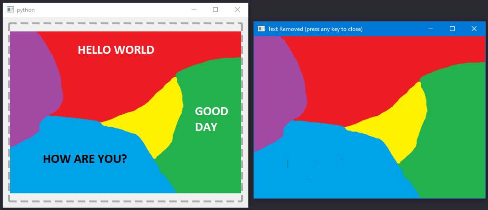
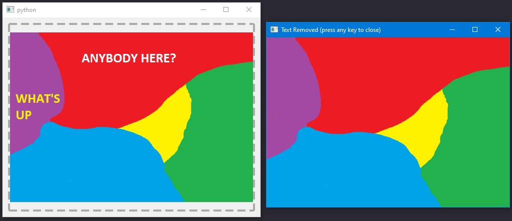

# cover-up
Cover text in images with background colours.

### Python3 Libraries used:
**Tesseract-OCR (pytesseract):** recognizes characters in image (please install Tesseract-OCR on your machine to run the program)

**OpenCV2 (cv2)**

**PyQt5:** make the GUI application

**numpy**

## How to Use:

1. Run app.py
```
python app.py
```


2. Drag and Drop the image you want to listen to.

## Examples:

1.


2.

